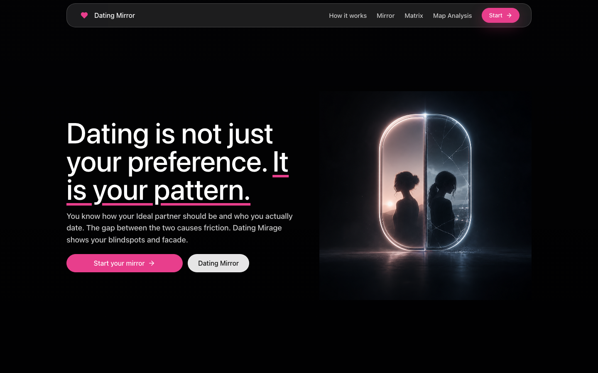
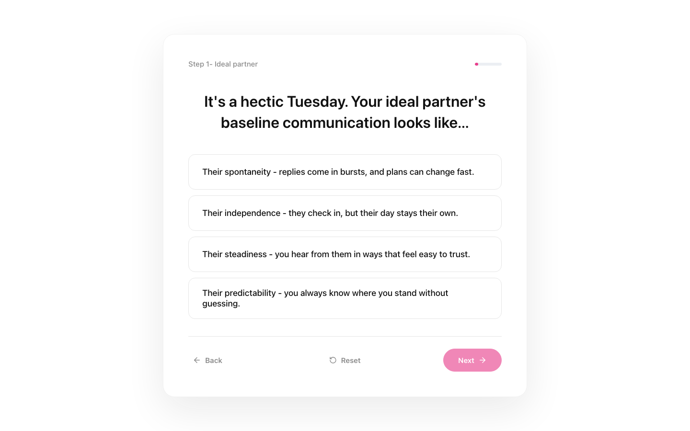
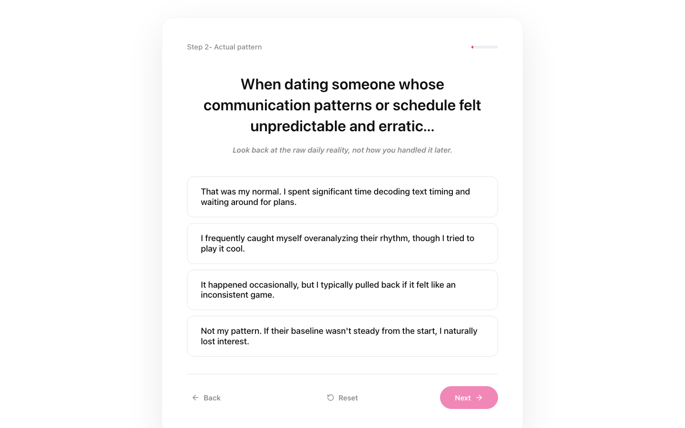
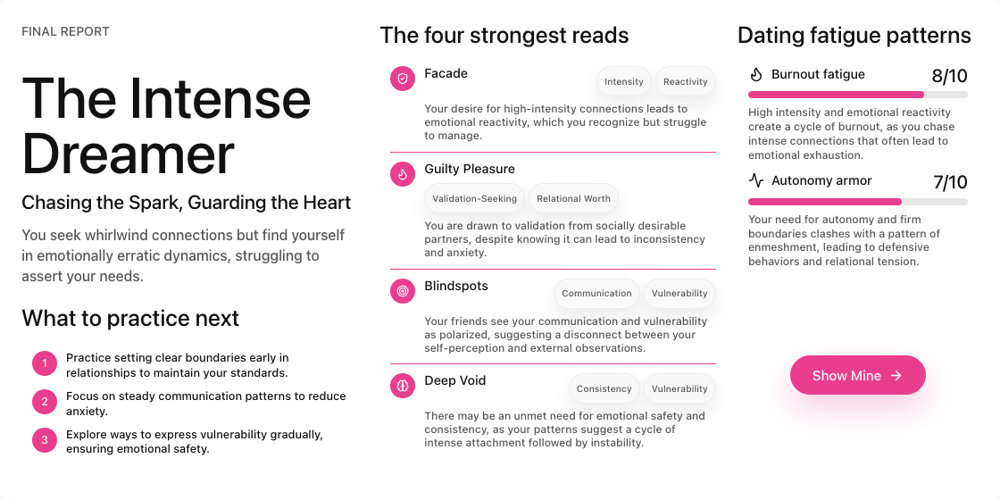
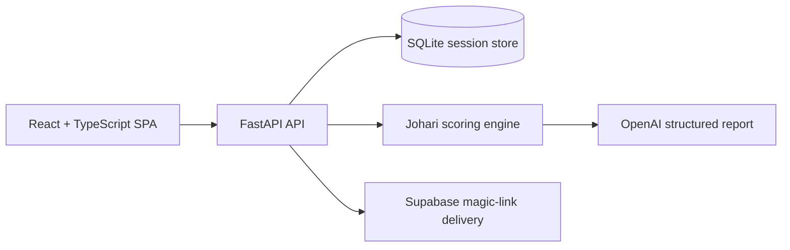

# Dating Mirror

Dating Mirror is a private, mobile-first reflection tool that compares what you say you want in a partner, who you actually choose, and what your friends notice about your dating patterns. It turns those three perspectives into a visual Johari-style report with practical next steps.

**Live app:** [https://dating-mirror.vercel.app](https://dating-mirror.vercel.app)



## What it does

Dating Mirror builds three profiles across eight relationship dimensions:

- **Ideal profile:** the qualities and dynamics you consciously want.
- **Actual profile:** the patterns visible in your recent dating history.
- **Social profile:** anonymized observations submitted by friends through a shareable link.

The app compares those profiles to surface conscious gaps, blind spots, recurring friction, and the strongest areas to work on next. It is designed as a behavioral reflection experience, not a clinical diagnosis or a substitute for therapy.

## How it works

### 1. Describe your ideal relationship

You answer eight scenario-based questions covering consistency, intensity, autonomy, validation-seeking, communication, vulnerability, reactivity, and relational worth. The interface keeps numerical scoring hidden so the choices feel natural.



### 2. Compare that ideal with your dating history

A rapid-fire set of behavior questions looks at what has actually happened in your recent relationships or situationships. The answers form your actual dating-pattern profile.



### 3. Invite your social mirror

The app creates a shareable link for friends. They complete a short, no-download feedback flow, and their responses are aggregated into one social profile. Individual answers are not shown to the user, and at least two friend responses are required before the final report unlocks.

### 4. Reveal the gaps and next steps

The Johari engine compares all three profiles, ranks the strongest tensions, and sends structured evidence to the report generator. The result explains the user's most visible patterns in plain language and suggests focused behaviors to practice next.



## How the analysis works

Each profile is represented as an eight-dimensional vector scored from `1.0` to `10.0`:

| Key   | Dimension          | Lower end              | Higher end               |
| ----- | ------------------ | ---------------------- | ------------------------ |
| `CON` | Consistency        | Erratic / hot-and-cold | Steady / predictable     |
| `INT` | Intensity          | Slow burn              | High-speed whirlwind     |
| `AUT` | Autonomy           | Enmeshed               | Fiercely independent     |
| `VAL` | Validation-seeking | Character-driven       | Status-driven            |
| `GOC` | Communication      | Avoids conflict        | Confronts and processes  |
| `VUL` | Vulnerability      | Guarded                | Open and raw             |
| `REA` | Reactivity         | Emotionally steady     | Absorbs a partner's mood |
| `RWO` | Relational worth   | Accommodates / settles | Holds firm boundaries    |

For every dimension, the backend calculates:

```text
Conscious gap = | ideal - actual |
Blind-spot gap = | actual - social |
Severity = sqrt(conscious_gap^2 + blind_spot_gap^2)
```

The highest-severity dimensions anchor the final narrative and radar-chart highlights. Friend disagreement is also retained as conflict metadata so a polarized response is not mistaken for neutral consensus.

## Architecture



### Main technologies

- React 19, TypeScript, Vite, and Tailwind CSS
- FastAPI, Pydantic, and Uvicorn
- SQLite for session and aggregated friend-feedback storage
- OpenAI Responses API for schema-constrained narrative reports
- Supabase for report-delivery magic links
- Vitest and Python `unittest` coverage

The frontend also keeps in-progress answers locally, allowing the questionnaire to continue when the API is temporarily unavailable.

## Run locally

### Prerequisites

- Node.js 20 or newer
- Python 3.12

### 1. Install dependencies

```bash
npm install

python3.12 -m venv .venv
source .venv/bin/activate
pip install -r backend/requirements.txt
```

### 2. Configure the environment

```bash
cp .env.example .env
```

Add the values needed for your environment:

| Variable                    | Purpose                                       |
| --------------------------- | --------------------------------------------- |
| `VITE_API_BASE_URL`         | FastAPI base URL used by the frontend         |
| `VITE_SUPABASE_URL`         | Supabase project URL used by the frontend     |
| `VITE_SUPABASE_ANON_KEY`    | Supabase public anonymous key                 |
| `OPENAI_API_KEY`            | Generates the final structured report         |
| `OPENAI_MODEL`              | Report-generation model; defaults to `gpt-4o` |
| `SUPABASE_URL`              | Server-side Supabase project URL              |
| `SUPABASE_ANON_KEY`         | Server-side magic-link client key             |
| `SUPABASE_SERVICE_ROLE_KEY` | Optional privileged server key                |
| `APP_ORIGIN`                | Frontend origin used in report links and CORS |
| `CORS_ORIGINS`              | Additional comma-separated allowed origins    |

Never commit `.env` or any secret values.

### 3. Start the backend

```bash
source .venv/bin/activate
uvicorn backend.main:app --reload --port 8000
```

The API health endpoint is available at `http://localhost:8000/health`.

### 4. Start the frontend

In another terminal:

```bash
npm run dev
```

Open `http://localhost:5173`.

## Verification

```bash
npm test
npm run build
python -m unittest backend.test_llm_report -v
```

## Privacy choices

- Friend responses are aggregated; the report does not identify who said what.
- The final report stays gated until the user receives at least two friend responses.
- Friends cannot open the user's report unless the user shares it.
- The **Burn My Data** action deletes the user's session and associated feedback.
- OpenAI report requests are sent with storage disabled.

## Project documentation

- [Product requirements](./docs/Product_PRD.md)
- [Implementation handoff](./docs/Project_Handoff.md)
- [Questionnaire and scoring copy](./docs/Questionaire.md)
- [Design system](./docs/Design_system.md)

## Deployment

The production frontend is deployed on Vercel and connected to the [`snepraj2709/Dating-Mirage`](https://github.com/snepraj2709/Dating-Mirage) repository.

**Production URL:** [https://dating-mirror.vercel.app](https://dating-mirror.vercel.app)
